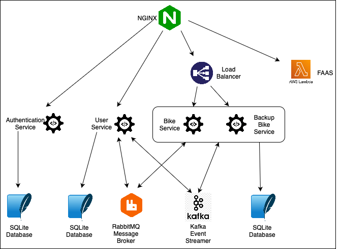

# Bike Rentals App

Bike Rental Management Application for Service-Oriented Architecture class

## Introduction

This project is a microservice-based application designed to manage authentication, user, and bike-related functionalities. It is fully containerized using Docker, with all components orchestrated and managed through Docker Compose.

The system integrates several backend services developed in Python with Flask, a microfrontend architecture built with Angular and Module Federation (for more details, refer to this [repository](https://github.com/AnastasiaSusciuc/MFE-BikeManagementApp)), and an NGINX load-balanced API gateway for efficient request routing. Additionally, the application supports serverless functions via AWS Lambda. Communication between microservices is handled through RabbitMQ, while event streaming is managed with Apache Kafka. The REST API is secured using JWT tokens to ensure safe authentication and authorization.

Here is an overview of the main components of the application:

### Backend Services
Auth Service: Handles user authentication and token generation.
User Service: Manages user-related data and operations, such as fetching user profiles.
Bike Service: Provides bike management features, with redundancy via a backup instance.

### API Gateway
The API Gateway, built with NGINX, serves as a reverse proxy and load balancer (for the bike microservice), routing requests to the appropriate backend services and the AWS Lambda-based serverless function.

### Database Layer
Each microservice is paired with its own dedicated SQLite instance to ensure data isolation and integrity.

### Message Brokers and Event Streaming
Message Brokering: Implemented with RabbitMQ, enabling asynchronous communication between the User Service and the Bike Service to manage bike rentals and returns. When a user rents or returns a bike, the User Service sends a message to the Bike Service via RabbitMQ to update bike availability.
Event Streaming: Utilizes Apache Kafka for real-time data streaming and processing. Kafka facilitates event-driven communication between the Bike Service and t

### FaaS (Function as a Service)

A Lambda function, /get-garages, demonstrates serverless computing in this application. Built using AWS Lambda, this function retrieves the number of garages needed for storing all the bikes. By using serverless architecture, it allows the system to handle user-specific data queries without the need for a dedicated backend service. The function is deployed and managed using the Serverless Framework, ensuring efficient deployment to AWS.

The following architecture diagram illustrates how all components come together: 

## Microfrontend Architecture

The front-end of the library management application is built as a microfrontend architecture using Module Federation with Webpack. It consists of a host (shell) and three microfrontends (auth, bike, and user) to provide a modular and scalable interface.

This is illustrated in the following architecture diagram:

### Authentication Microservice
The Authentication Microservice manages user registration and authentication. It provides REST API endpoints for user management and ensures secure authentication through JWT tokens.

Key Features
- User registration with input validation.
- Secure login with password hashing and verification.
- JWT token generation for authenticated access.

Main Components
- User Model: Stores user information, including username, hashed password, name, and role (user or librarian).
- REST API Endpoints:
  - /register – Registers a new user.
  - /login – Authenticates a user and returns a JWT token.

Below is the UML diagram generated using Python's Graphviz library:

### Bike Microservice
The Bike Microservice manages bike rentals, availability, and waiting lists. It provides functionality for adding, searching, and managing bikes while integrating with RabbitMQ for rental events.

Key Features
- Add new bikes with details like model, brand, serial number, and available units.
- Search bikes by model or brand.
- Manage rentals and waiting lists.

Main Components
- Bike Model: Stores bike details such as model, brand, serial number, and available units.
- Rental Model: Tracks user rentals, including rented-on and return-by dates.
- WaitingList Model: Maintains a list of users waiting for unavailable bikes.
- REST API Endpoints
  - /add – Add a new bike (admin only).
  - /all_bikes – Retrieve all bikes.
  - /rented_bikes – Get bikes rented by a user.
  - /search – Search bikes by model.
  - /search_by_brand – Search bikes by brand.
 
Messaging Integration
- receive_rent_request – Sends bike rental requests to RabbitMQ.
- receive_return_request – Sends bike return requests to RabbitMQ.

Below is the UML diagram generated using Python's Graphviz library:

### User Microservice
The User Microservice manages user profiles, rental actions, and communication with the Bike Microservice via RabbitMQ. It ensures secure access using JWT tokens.

Key Features
- Retrieve and update user profiles.
- Handle bike rentals and returns with RabbitMQ integration.
- Fetch all users (admin only).

Main Components
- User Model: Represents user profiles, including username, name, role, and created_at.
- REST API Endpoints

  - /profile – Retrieve or create a user profile.
  - /rent – Send a bike rental request via RabbitMQ.
  - /return – Send a bike return request via RabbitMQ.
  - /users – Fetch all users (admin only).
  
Messaging Integration
- send_rent_request – Sends bike rental requests to RabbitMQ.
- send_return_request – Sends bike return requests to RabbitMQ.

Below is the UML diagram generated using Python's Graphviz library:

